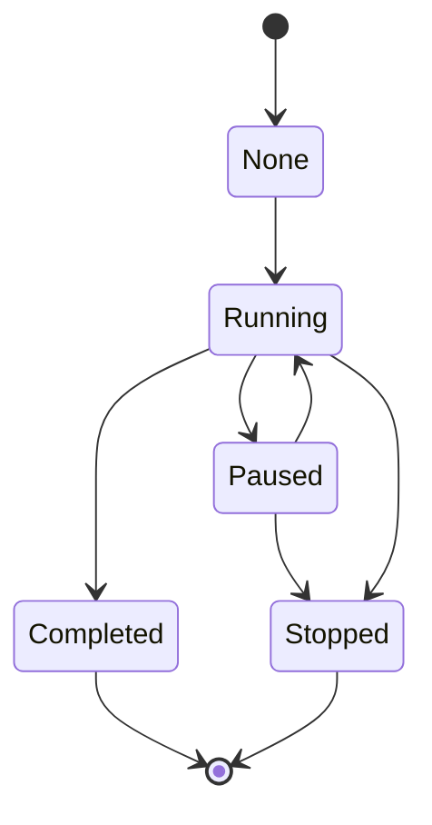

# AsyncTaskLib

AsyncTaskLib is a library providing a solution for running task asynchronously.
An object of type ThreadPool has to be created and provides an API to create, 
pause, resume or even stop a task.

## Build

So as to build the AsyncTaskLib library only, open it and then, create a build directory, run cmake on the target, then make:
```
mkdir build
cd build
cmake ..
make
```

## Requirements

Cmake version 3.22 is required. If you don't have it, replace the minimum cmake requirement in CMakeLists.txt files and cross your fingers :)


## State chart of an Asynchronous task

The following state machine describes in which state an asynchronous task can be and what are the transitions from each state.

