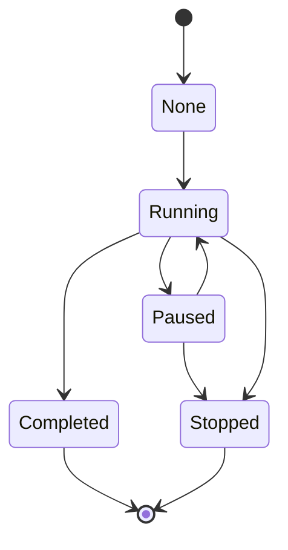

# AsyncTaskProgram

# State chart of an Asynchronous task

The following state machine describes in which state an asynchronous task can be and what are the transitions from each state.

```mermaid
stateDiagram-v2
[*] --> None
None --> Running
Running --> Paused
Paused --> Running
Paused --> Stopped
Running --> Stopped
Running --> Completed
Completed --> [*]
Stopped --> [*]
```